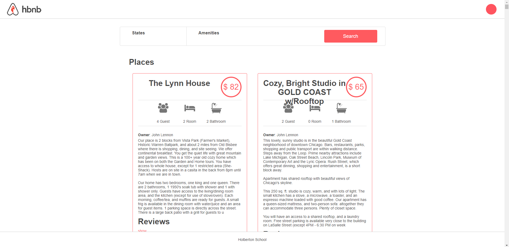
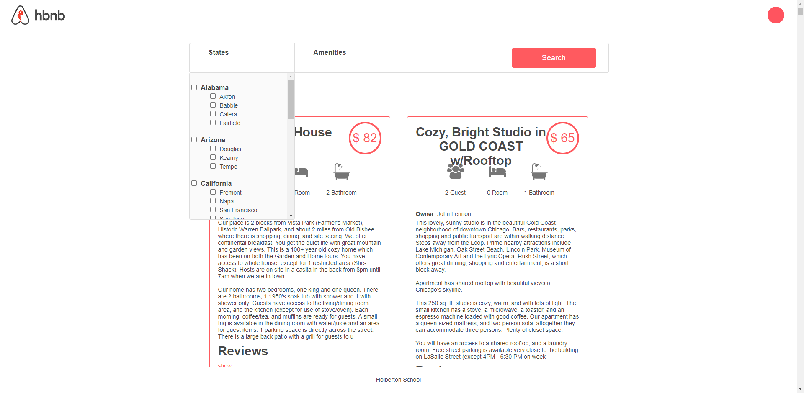

<div align="center">
<h1>AirBnB Clone</h1>
</div>


## Table of Content
- [Description](#description)
  - [Installation](#installation)
  - [Environment variables](#environment-variables)
  - [Usage](#usage)
  - [Screenshots](#screenshots)
  - [Authors](#authors)
  - [License](#license)

# Description
This repository contains a complete Full Stack web application. The stack is HTML5/CSS3/JavaScript(jQuery) on the front-end, Python(Flask)/Gunicorn on the back-end, and MySQL on the database.


This Project at Holberton School is divided into four projects developed in two months. And this project is created to include all the features created in the previous project.

Links to all versions.

1. [AirBnB_Clone](https://github.com/WardenCode/AirBnB_clone)
2. [AirBnB_Clone_v2](https://github.com/WardenCode/AirBnB_clone_v2)
3. [AirBnB_Clone_v3](https://github.com/WardenCode/AirBnB_clone_v3)
4. [AirBnB_Clone_v4](https://github.com/WardenCode/AirBnB_clone_v4)

## Installation
Follow the next steps for install the program
```bash
sudo apt-get install libmysqlclient-dev
git clone https://github.com/WardenCode/holbertonschool-AirBnB_clone_v4.git
cd holbertonschool-AirBnB_clone_v4
pip install -r requirements.txt
```
To use test fixtures use mysql directory with data dummy

## Environment variables

- `HBNB_ENV`: running environment. It can be “dev” or “test” for the moment (“production” with fabric)
- `HBNB_MYSQL_USER`: the username of your MySQL
- `HBNB_MYSQL_PWD`: the password of your MySQL
- `HBNB_MYSQL_HOST`: the hostname of your MySQL
- `HBNB_MYSQL_DB`: the database name of your MySQL
- `HBNB_TYPE_STORAGE`: the type of storage used. It can be “file” (using FileStorage) or db (using DBStorage)
- `HBNB_API_HOST`: the API host or 0.0.0.0 by default
- `HBNB_API_PORT`: the API port or 5000 by default
- `HBNB_WEB_HOST`: The WEB host or 0.0.0.0 by default
- `HBNB_WEB_PORT`: the API port or 5001 by default

## Usage
Activate API Client
```bash
HBNB_MYSQL_USER=hbnb_dev HBNB_MYSQL_PWD=hbnb_dev_pwd HBNB_MYSQL_HOST=localhost HBNB_MYSQL_DB=hbnb_dev_db HBNB_TYPE_STORAGE=db python3 -m api.v1.app
```
Activate Web Server
```bash
HBNB_MYSQL_USER=hbnb_dev HBNB_MYSQL_PWD=hbnb_dev_pwd HBNB_MYSQL_HOST=localhost HBNB_MYSQL_DB=hbnb_dev_db HBNB_TYPE_STORAGE=db python3 -m web_dynamic.hbnb
```

## Screenshots

**Main page**



**Filters**



## Authors
Alexa Orrico - [Github](https://github.com/alexaorrico) / [Twitter](https://twitter.com/alexa_orrico)
Jennifer Huang - [Github](https://github.com/jhuang10123) / [Twitter](https://twitter.com/earthtojhuang)
Jhoan Zamora - [Github](https://github.com/jzamora5) / [Twitter](https://twitter.com/JhoanZamora10)
David Ovalle - [Github](https://github.com/Nukemenonai) / [Twitter](https://twitter.com/disartDave)

Second part of Airbnb: Joann Vuong

Fourth part of Airbnb:
Luis Manrique - [Github](https://github.com/luismch158158) / [Twitter](https://twitter.com/LuisManriqueDev)
Diego Linares - [Github](https://github.com/WardenCode) / [Twitter](https://twitter.com/WardenCode)

## License
[Unlicense](https://unlicense.org)
